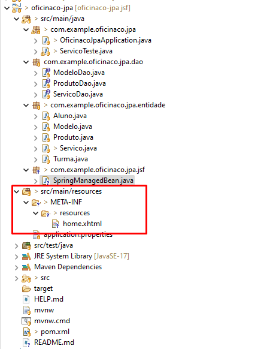

## Configure as dependencias

Adicione as seguintes dependencias no arquivo pom.xml

```xml
        <dependency>
            <groupId>org.springframework.boot</groupId>
            <artifactId>spring-boot-starter-web</artifactId>
        </dependency>
        <dependency>
            <groupId>org.apache.tomcat.embed</groupId>
            <artifactId>tomcat-embed-jasper</artifactId>
            <scope>provided</scope>
        </dependency>

        <dependency>
            <groupId>org.glassfish</groupId>
            <artifactId>javax.faces</artifactId>
            <version>2.2.12</version>
        </dependency>
        <dependency>
            <groupId>org.primefaces</groupId>
            <artifactId>primefaces</artifactId>
            <version>5.3</version>
        </dependency>
        <dependency>
            <groupId>javax.inject</groupId>
            <artifactId>javax.inject</artifactId>
            <version>1</version>
        </dependency>
```

## Configure o servidor no spring-boot

Faça a classe MAIN implementar a interface ServletContextInitializer:

```java
@SpringBootApplication
public class OficinacoJpaApplication implements ServletContextInitializer{
 ...
} 
```

Depois adicione os elementos abaixo na classe MAIN

```java
	@Override
	public void onStartup(ServletContext servletContext) throws ServletException {
		servletContext.setInitParameter("javax.faces.DEFAULT_SUFFIX", ".xhtml");
		servletContext.setInitParameter("javax.faces.PARTIAL_STATE_SAVING_METHOD", "true");

		servletContext.setInitParameter("javax.faces.PROJECT_STAGE", "Development");
		servletContext.setInitParameter("facelets.DEVELOPMENT", "true");
		servletContext.setInitParameter("javax.faces.FACELETS_REFRESH_PERIOD", "1");

		Set<Class<?>> clazz = new HashSet<Class<?>>();

		clazz.add(OficinacoJpaApplication.class); 

		FacesInitializer facesInitializer = new FacesInitializer();
		facesInitializer.onStartup(clazz, servletContext);
	}

	@Bean
	public ServletListenerRegistrationBean<JsfApplicationObjectConfigureListener> jsfConfigureListener() {
		return new ServletListenerRegistrationBean<JsfApplicationObjectConfigureListener>(
				new JsfApplicationObjectConfigureListener());
	}


	static class JsfApplicationObjectConfigureListener extends ConfigureListener {

		@Override
		public void contextInitialized(ServletContextEvent sce) {
			super.contextInitialized(sce);

			ApplicationFactory factory = (ApplicationFactory) FactoryFinder.getFactory(FactoryFinder.APPLICATION_FACTORY);
			Application app = factory.getApplication();

			app.addELResolver(new SpringBeanFacesELResolver());
		}
	}	

```    

Pronto! JSF configurado....

## Agora, vamos criar a primeira tela

Crie o ManagedBean, uma classe java da seguinte forma:

```java
import javax.faces.bean.SessionScoped;

import org.springframework.stereotype.Component;


@Component
@SessionScoped
public class SpringManagedBean {

	private String message = "OK ";
	
	public void acao() {
		message += " Clicou";
	}

	public String getMessage() {
		return message;
	}

	public void setMessage(String message) {
		this.message = message;
	}
	
	

}
```

Depois crie a tela... Esta deve ficar em: 

```
src/main/resources
    +- META-INF
         +-resources
            +- home.xhtml
```

Assim: 



Código da tela:

```xhtml
<!DOCTYPE html>
<html lang="en"
      xmlns="http://www.w3.org/1999/xhtml"
      xmlns:h="http://xmlns.jcp.org/jsf/html"
      xmlns:p="http://primefaces.org/ui">

<h:head>
    <title>Hello, Spring and JSF World!</title>
</h:head>
<h:body>
	<h:form>
	    <p:panel header="Exemplo">
	        <h:outputText id="msg" value="#{springManagedBean.message}"/>
	        <p:commandButton update="msg" action="#{springManagedBean.acao}" value="Clique"/>
	    </p:panel>
	</h:form>


</h:body>
</html>
```

## Testando

Acesse

http://localhost:8080/home.xhtml